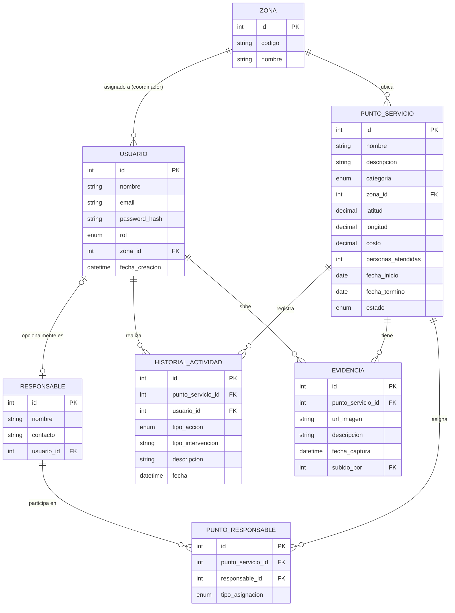

# Puntos de Servicio App

App móvil en Flutter que muestra en un mapa interactivo puntos de servicio distribuidos en zonas de una ciudad, con búsqueda, filtros, tarjeta de detalle rápido, pantalla de detalle completo, y una API propia en FastAPI que la respalda.

## Requisitos previos

- Flutter SDK `>=3.3.0`
- Python `>=3.10`
- Un emulador Android/iOS configurado, o un dispositivo físico con depuración USB

## Instalación y ejecución

```bash
git clone https://github.com/JRMZ1298/app_puntos_acceso.git
cd app_puntos_acceso
```

### 1. Levantar la API (necesaria para la Parte 5 y para usar datos reales)

```bash
git clone https://github.com/JRMZ1298/backend_puntos_servicio.git
cd backend_puntos_servicio
pip install -r requirements.txt
.\.venv\Scripts\activate
uvicorn app.main:app --reload
```

Documentación interactiva disponible en `http://127.0.0.1:8000/docs`.

### 2. Correr la app Flutter

```bash
cd app_puntos_acceso
flutter pub get
flutter run
```

Por defecto, la app usa datos **mock locales** (no depende de la API para el mapa/lista/filtros/búsqueda). Para consumir la API real, cambia `usarApiRemotaProvider` a `true` en `lib/features/puntos_servicio/presentation/providers/punto_servicio_providers.dart`. La función de la Parte 5 ("registrar intervención") sí depende siempre de la API estar corriendo, sin importar ese switch.

**Nota sobre `localhost` en emuladores:** ver comentario en `lib/core/constants/api_constants.dart` — el emulador Android usa `10.0.2.2`, no `127.0.0.1`.

Generar el APK para entrega:

```bash
flutter build apk --release
```

Queda en `app_puntos_acceso/build/app/outputs/flutter-apk/app-release.apk`.

## Arquitectura de la app (Flutter)

Clean Architecture por feature, separando responsabilidades en tres capas dentro de `lib/features/puntos_servicio/`:

```
lib/
├── core/
│   └── constants/         # api_constants.dart (URL base de la API)
└── features/
    └── puntos_servicio/
        ├── domain/                # reglas de negocio puras, sin dependencias externas
        │   ├── entities/          # PuntoServicio, ResultadoVerificacionIntervencion
        │   └── repositories/      # PuntoServicioRepository (contrato abstracto)
        ├── data/                  # implementación concreta del acceso a datos
        │   ├── models/            # PuntoServicioModel (fromJson/toJson)
        │   ├── datasources/       # PuntoServicioDatasource (contrato), MockLocalDatasource,
        │   │                      # RemoteDatasource, VerificacionIntervencionDatasource
        │   └── repositories/      # PuntoServicioRepositoryImpl
        └── presentation/          # UI y manejo de estado
            ├── providers/         # Riverpod: datos, filtros, búsqueda, verificación
            ├── screens/           # HomeScreen, MapaScreen, ListaScreen, DetalleScreen, PerfilScreen
            └── widgets/           # BarraBusqueda, FiltrosSheet, PuntoBottomSheet,
                                    # RegistrarIntervencionDialog
```

**Flujo de dependencias:** `presentation` → `domain` ← `data`. La capa `domain` no conoce Flutter ni JSON. `MockLocalDatasource` y `RemoteDatasource` implementan el mismo contrato (`PuntoServicioDatasource`), así que cambiar de uno a otro no requiere tocar `domain` ni `presentation` — solo el provider que decide cuál usar.

### Navegación

`HomeScreen` contiene la `NavigationBar` inferior con 3 pestañas (`IndexedStack` para conservar el estado de cada una):

- **Mapa** — vista principal con `flutter_map`
- **Lista** — mismos puntos en formato lista, comparte búsqueda y filtros con el mapa
- **Perfil** — placeholder, fuera del alcance actual (se completará junto con autenticación/permisos)

## Arquitectura de la API (FastAPI)

```
api/
├── requirements.txt
└── app/
    ├── main.py
    ├── models/         # Pydantic: PuntoServicio, HistorialActividad, esquemas de verificación
    ├── data/            # mock_puntos.py (mismos 6 puntos que usa la app), mock_historial.py
    ├── routers/         # puntos.py, verificacion.py
    └── services/        # verificacion_service.py

```

**Endpoints:**

- `GET /puntos` — todos los puntos (acepta `?zona=03`)
- `GET /puntos/{id}` — un punto (404 si no existe)
- `POST /intervenciones/verificar`

# Arquitectura del proyecto



## Dependencias

**Flutter:**

| Paquete            | Uso                                                                |
| ------------------ | ------------------------------------------------------------------ |
| `flutter_riverpod` | Manejo de estado                                                   |
| `flutter_map`      | Mapa interactivo                                                   |
| `latlong2`         | Tipo `LatLng` requerido por `flutter_map`                          |
| `intl`             | Formato de moneda y fechas                                         |
| `http`             | Consumo de la API (RemoteDatasource, verificación de intervención) |

**API:**

| Paquete    | Uso                                   |
| ---------- | ------------------------------------- |
| `fastapi`  | Framework de la API                   |
| `uvicorn`  | Servidor ASGI                         |
| `pydantic` | Validación y serialización de modelos |
| `pytest`   | Pruebas unitarias                     |

## Decisiones técnicas

- **Mapa: `flutter_map` + OpenStreetMap**, en lugar de `google_maps_flutter`. Se eligió porque no requiere API key ni configuración de facturación en Google Cloud, lo que simplifica el setup dentro del tiempo del ejercicio.
- **Gestor de estado: Riverpod**. Se eligió por su soporte actual en el ecosistema Flutter. Se usan `FutureProvider` (carga async de datos), `Provider` (valores derivados/repositorio) y `StateNotifierProvider`/`StateProvider` (filtros y búsqueda).
- **Origen de datos: mock local por defecto, API real intercambiable**. `MockLocalDatasource` y `RemoteDatasource` implementan el mismo contrato `PuntoServicioDatasource`; el provider `usarApiRemotaProvider` decide cuál se usa, sin tocar `domain` ni la UI.
- **API: FastAPI**, por rapidez de desarrollo, documentación automática (`/docs`).
- **Imágenes de evidencia: URLs de placeholder** (`picsum.photos`), en vez de assets locales, para no incrementar el peso del repositorio con imágenes de prueba.
- **Búsqueda y filtros combinados**: ambos se aplican sobre la misma lista base a través de un único provider derivado (`puntosFiltradosProvider`), evitando lógica duplicada entre la vista de mapa y la vista de lista.
- **Modelo de datos**: `Responsable` se modeló separado de `Usuario` (no todo responsable tiene acceso al sistema, ej. un proveedor externo), y la relación `PuntoServicio` ↔ `Responsable` usa una tabla puente (`PuntoResponsable`) en vez de columnas fijas, para permitir que un mismo responsable participe en varios puntos con distintos roles.
